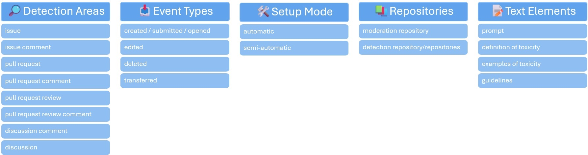

<h1 align="center">RepoReferee</h1>

<b><i>Author: Szymon Kaczmarski</i></b>

<i><a href="mailto:szymon.kaczmarski@uzh.ch">szymon.kaczmarski@uzh.ch</a></i>

    
     
    <em>This image was created with the assistance of DALL·E 3.</em>

Revolutionizing GitHub moderation with expert-driven design and the precision of GPT-4 Omni

---

RepoReferee is designed as a GitHub App, making use of the [Probot framework](https://probot.github.io/) and [OpenAI API](https://platform.openai.com/playground/chat?models=gpt-4o).  
The entire application is coded in TypeScript.

- <b>for more details about bot's behaviour, please refer to [Bots actions and reponses](./2_bot_actions_and_responses.md).</b>
- <b>for configuration and deployment procedure, please refer to [Configuration Guidelines](./3_setup_and_deployment.md).</b>
## Key Features

The bot is designed to work within a specific organization on GitHub.
Whenever toxic message is posted on the GitHub repository, RepoReferee will automatically detect it and assess it in terms of toxicity. If the message is toxic, the bot will document this action on the moderation repository in the form of an issue.
If the bot works in an automatic fashion it will post a generated moderation response as a replay to the toxic message, for instance an issue comment.
Moderation responses are generated by the GPT-4 Omni model and include four aspects:

- <b>🕵️Toxicity Detection</b>: identifying whether the text is toxic
- <b>🧐Explanation and Identification of Toxicity</b>: determining correct type of toxicity
- <b>📜Reasoning and Guidelines</b>: providing correct reasoning based on guidelines
- <b>✍️Rephrasing Options</b>: proposing correct rephrased sentences that are no longer toxic

_Results for each respective category are described in detail in an associated [Master Thesis](https://gitlab.uzh.ch/szymon.kaczmarski/reporeferee-replication-package/)._

The functionality of the bot is based on a 3-shot prompt that is used to generate the moderation response. The prompt is designed to provide the bot with the necessary information to generate a response. That includes: the toxic message, the context of the message, toxicity definition, sub-toxicity definitions including their examples and guidelines.

- The prompt creation can be seen in [src/GPTApiService.ts](../src/GPTApiService.ts#L202) file in _generatePrompt_ function.
- Toxicity defintions, examples and guidelines are stored in [src/config/TOXICITY_DEFINITIONS.ts](../src/config/TOXICITY_DEFINITIONS.ts) file.
- For the purpose of this implementation, [Mozilla Community Participation Guidelines](https://www.mozilla.org/en-US/about/governance/policies/participation/) were used.

## Functionality Overview

The bot is configurable in terms of types of GitHub communication elements(e.g. issues and its comments) and events it reacts to.
Therefore, the maintainer can configure the bot to react only to specific detection areas and particular events.
For instance, exclusively creation of issue and pull request comments.
This can be done using [src/config/event-config.ts](../src/config/event-config.ts) file.

Replaying with moderation response for a discussion or a discussion comment is currently not supported due to the limitations of the library used for handling the requests related to creation and editing.  
Another degree of customization relates to the mode of operation:

- <b>Automatic</b>: the bot will automatically detect and replay to toxic messages.
- <b>Semi-automatic</b>: the bot will detect toxic messages, but the moderation response will require human approval.

All of the prompt's elements may be adjusted according to the moderation needs.

Additionally, moderator needs to specify which repositories to monitor and which one should be used for documenting moderation cases.
