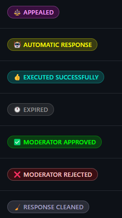
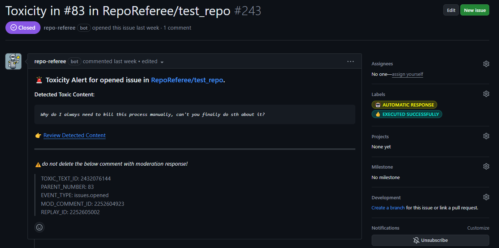
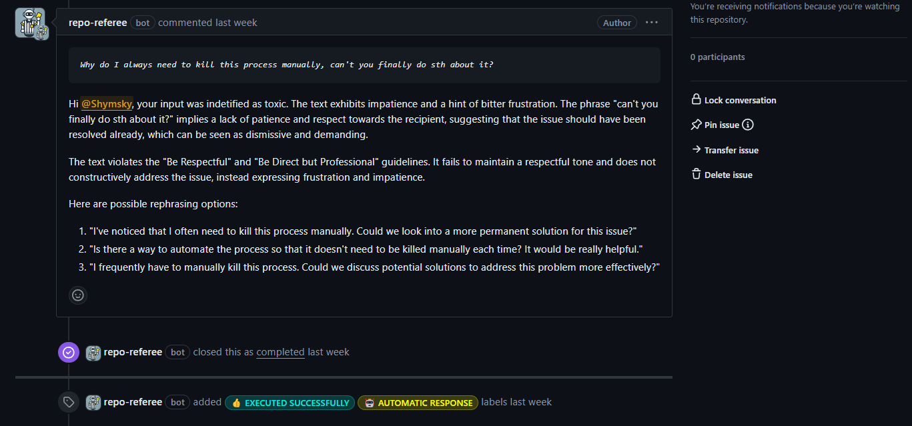
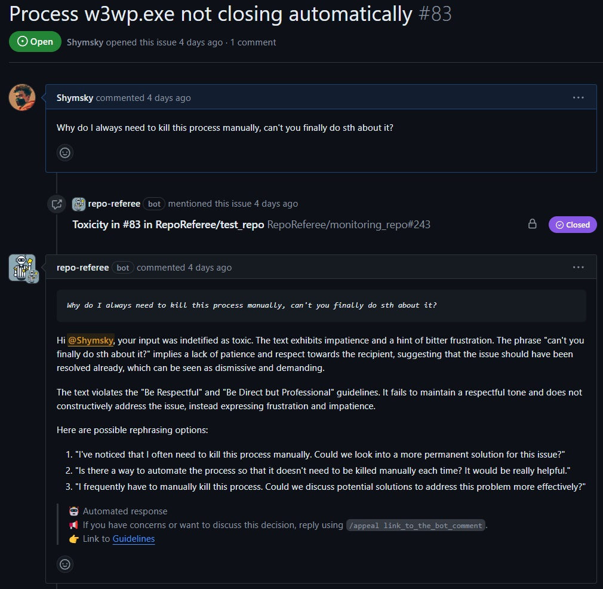

# Toxic Content Handling

---

The bot is designed to detect and respond to toxic content within community interactions and across various repositories.

It reacts to specific events and automatically assesses the content for toxicity.

Configration requires, among others, the definition of the following parameters in the `.env` file, for example:

```env
MODERATION_REPO=monitoring_repo
DETECTION_REPOS=test_repo,second_test_repo
IS_AUTOMATIC_MODE=true
```

## Bot's Triggers

The configuration of [src/config/event-config.ts](../src/config/event-config.ts) allows you to specify which events related to GitHub entities such as issues, pull requests, and discussions should trigger the moderation bot. Each entity type and associated events can be toggled on or off based on your requirements.

#### Issues

- `opened`: Set to `true` to enable the bot to react to newly opened issues.
- `edited`: Set to `true` to enable the bot to react to any edits made to issues.
- `deleted`: Set to `true` to enable the bot to react to the deletion of issues.
- `transferred`: Set to `true` to enable the bot to react to issues being transferred to another repository.

#### Issue Comments

This insludes the PR comments (as in API they are treated as issue_comment)

- `created`: Set to `true` to enable the bot to react to newly created issue/PR comments.
- `edited`: Set to `true` to enable the bot to react to edits made to issue/PR comments.
- `deleted`: Set to `true` to enable the bot to react to deletions of issue/PR comments.

#### Pull Requests

- `opened`: Set to `true` to enable the bot to react to newly opened pull requests.
- `edited`: Set to `true` to enable the bot to react to any edits made to pull requests.

#### Pull Request Reviews

- `submitted`: Set to `true` to enable the bot to react to submitted pull request reviews.
- `edited`: Set to `true` to enable the bot to react to edits made to pull request reviews.

#### Pull Request Review Comments

- `created`: Set to `true` to enable the bot to react to newly created pull request review comments.
- `edited`: Set to `true` to enable the bot to react to edits made to pull request review comments.
- `deleted`: Set to `true` to enable the bot to react to deletions of pull request review comments.

#### Discussions

- `created`: Set to `true` to enable the bot to react to newly created discussions.
- `edited`: Set to `true` to enable the bot to react to edits made to discussions.
- `deleted`: Set to `true` to enable the bot to react to deletions of discussions.
- `transferred`: Set to `true` to enable the bot to react to discussions being transferred to another repository.

#### Discussion Comments

- `created`: Set to `true` to enable the bot to react to newly created discussion comments.
- `edited`: Set to `true` to enable the bot to react to edits made to discussion comments.
- `deleted`: Set to `true` to enable the bot to react to deletions of discussion comments.

## Bot's Labels

In order to offer the full functionality the bot uses a set of labels to categorize and track the status of each moderation issue effectively. The labels are as follows:



Their use case will be described in the following section.

## Bot's Workflow:

#### 1) Detection

The bot scans for toxic content, triggered by messages indicated in the [src/config/event-config.ts](../src/config/event-config.ts).

#### 2) Evaluation

Upon trigger the bot sends the content to GPT for analysis based on four specific criteria, underlined in [Key Features](./1_functionality_overview.md#Key-Features).

#### 3) Moderation Issue Creation

If toxicity is detected, the bot automatically generates a moderation issue in a specified moderation repository. This issue includes detailed information the original toxic message, a direct link to its location, and a pre-formulated moderation message for potential use.

- <b>Automatic Mode</b>: If set to automatic, the bot immediately sends the prepared moderation message and closes the issue, marking it with "executed successfully" and "automatic response" labels.
- <b>Semi-Automatic Mode</b>: In this mode, a moderator reviews the content. Upon approval (labeling the open issue with "moderator approved" label and closing the issue), the bot proceeds as in the automatic mode. If rejected (labeling the open issue with "moderator rejected" label and closing the issue), the bot does not send the message.
  Additionally, in this mode, the moderation issue description includes instruction section for the moderator, visible right above `👉 Review Detected Content`:

  ```
  Action Required:
  - [ ] Please review and address the toxic content identified in the description of the issue.
  - [ ] You can edit the moderation response below or approve it as is (by closing this issue).
  ```

  💡Before approval the moderator can edit the proposed moderation message.
  
  
  The result for automated mode is visible below:
  
  In case the bot is operating in the semi-automatic mode, bottom part of the message

  ```
  🤖 Automated response
  ```

  will be replaced by

  ```
  ✅ Response reviewed and approved by a human moderator
  ```

## Handling Edits and Deletions:

#### 1) Response Cleaning

The bot is able to automatically clean up the moderation response in cases where the posted moderation repsonse is no longer relevants, such as:

- already addressed toxic message(moderation response was sent) is edited and now is no longer toxic.
- already addressed toxic message(moderation response was sent) is deleted by the user.

In those cases the bot proccedes with removal, labels the associated moderation issue with "response cleaned" and posts a comment under the moderation issue informing the moderator about the action.

_⚠️ This functionality only occurs in association with the following expiration labeling of moderation cases._

#### 2) Expiry of Issue

When a message is edited and is no longer toxic or remains toxic even after the edit, the bot closes the current issue as "expired" and opens a new issue to address the newly assessed content.
Expired label is also used for cases when content was transferred to a different reopistory or deleted.

Therefore, these are the set of different messages a moderator can expect to see the under the moderation issue in the form of the comment:

```

[SYSTEM_INFO]
This instance in test_repo was edited. After edit it is no longer toxic.
Associated moderation responses were deleted.
This moderation issue will be closed and marked as expired.

[SYSTEM_INFO]
This instance in test_repo was edited. After edit it is no longer toxic.
This moderation issue will be closed and marked as expired.

[SYSTEM_INFO]
This instance in test_repo was edited. After edit it is still toxic.
Look into a newly opened moderation issue for more details.
This moderation issue will be closed and marked as expired.

[SYSTEM_INFO]
This instance in test_repo was deleted. Associated moderation responses were deleted.
This moderation issue will be closed and marked as expired.

[SYSTEM_INFO]
This instance in test_repo was deleted.
This moderation issue will be closed and marked as expired.

[SYSTEM_INFO]
This moderation issue was closed and marked as expired because the entire parent issue was deleted.

[SYSTEM_INFO]
This instance in test_repo was transferred to new repo: RepoReferee/transferred_repo#9.
This moderation issue will be closed and marked as expired.

```

## Appeal Process:

Users can appeal from moderation decisions. If an appeal is made, the bot reopens the moderation issue and labels it as "appealed", allowing for reassessment of the moderation action.
The appeal can be made by posting a comment under the moderation issue with the following content:

```
\appeal link_to_the_bot_comment
```

The link can be easily obtained by clicking three dots on the right top side of the bot's comment and selecting "Copy link".
